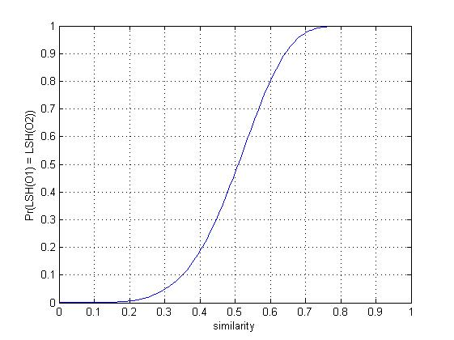
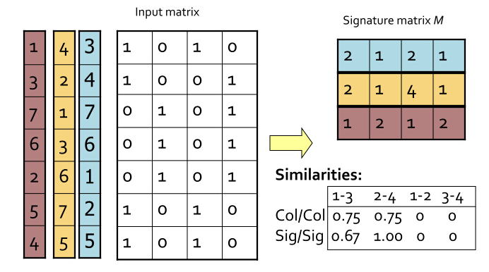
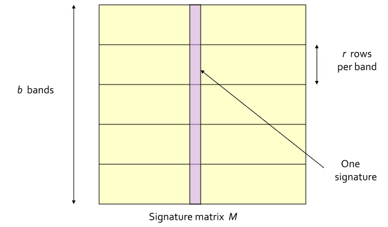
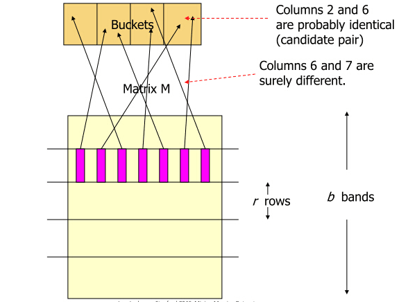

# LSH

局部敏感哈希算法(Locality Sensitive Hashing)

## 作用
LSH最根本的作用，就是能高效处理海量高维数据的最近邻问题（降维）


## 定义

我们将这样的一族hash函数 H={h:S→U} 称为是(r1,r2,p1,p2)敏感的，如果对于任意H中的函数h，满足以下2个条件：
$$
if\ d(O1,O2)<r1，then\ Pr[h(O1)=h(O2)]≥p1
$$

$$
if\ d(O1,O2)>r2，then\ Pr[h(O1)=h(O2)]≤p2
$$

其中，$O1,O2∈S$，表示两个具有多维属性的数据对象，$d(O1,O2)$为2个对象的相异程度，也就是1 - 相似度。其实上面的这两个条件说得直白一点，就是当足够相似时，映射为同一hash值的概率足够大；而足够不相似时，映射为同一hash值的概率足够小。

比如:

```
- 如果用Jaccard系数度量数据相似度时,则采用min-hashing
- 如果用欧氏距离度量数据相似度时的P-stable hash
```

<u>这里的d函数，即判断两个对象的距离的标准不同，则对应的hash函数的策略就得不同。即使得$P(h(Si)=h(Sj)) = sim(Si,Sj)$，这里sim函数和d函数相反，即在一个距离判断标准下，两个对象越接近，则他们hash值相等的概率越大。</u>***注意这里变成了等号来表示两者之间的关系，从而需要靠函数族的方法来从等号，再变回>=，即类似下图的形式***。



## 不同度量方法下的Hash函数

#### Jaccard系数—>Min-hashing

**定义：**

- Min-hashing：特征矩阵按行进行一个随机的排列后，第一个列值为1的行的行号。
- Signature vector：min-hashing得到的向量叫做签名向量即Signature vector
- Signature matrix：多次min-hashing后的Signature vector组合成的矩阵



**证明**：我们考虑$Si$和$Sj$这两列，它们所在的行的所有可能结果可以分成如下三类：

　　（1）A类：两列的值都为1；

　　（2）B类：其中一列的值为0，另一列的值为1；

　　（3）C类：两列的值都为0.

​	特征矩阵相当稀疏，导致大部分的行都属于C类，但只有A、B类行的决定$sim(Si,Sj)$，假定A类行有a个，B类行有b个，那么根据Jaccard系数度量的概念（交/并），$sim(si,sj)=a/(a+b)$。

​	现在我们只需要证明对矩阵行进行随机排列，两个的最小hash值相等的概率$P(h(Si)=h(Sj))=a/(a+b)$，如果我们把C类行都删掉，那么第一行不是A类行就是B类行，如果第一行是A类行那么$h(Si)=h(Sj)$，因此$P(h(Si)=h(Sj))=P(删掉C类行后，第一行为A类)=A类行的数目/所有行的数目=a/(a+b)$，这就是最小hash正确性的原理（符合LSH定义）。


## 构造LSH函数族

即：通过LSH多次抽样，hash相同的次数多（概率高）的对象则被认为是相似的。（不相同的概率低）

#### Min-hashing函数族构造



步骤：

1. 采用将signature matrix水平分割成一些区块（记为band）的方式
2. 对每个band计算hash值，这里的hash算法没有特殊要求，MD5，SHA1等等均可。这个hash值也就作为每个hash bucket的tag。
3. 如果某两个文档的，某一水平方向上的band，映射成了同一hash值，我们就将这两个文档映射到同一个hash bucket中，也就是认为这两个文档是足够相近的。如图所示：



概率证明：

- 对于两个文档的任意一个band来说，这两个band值相同的概率是：$s^r$，其中$s∈[0,1]$是这两个文档的相似度。
- 也就是说，这两个band不相同的概率是$1-s^r$
- 这两个文档一共存在b个band，这b个band都不相同的概率是$(1-s^r)^b$
- 所以说，这b个band至少有一个相同的概率是$1-(1-s^r)^b$

我愿意把这样的方法称为<u>AND then OR</u>，它是先要求每个band的所有对应元素必须都相同，再要求多个band中至少有一个相同。符合这两条，才能发生hash碰撞。

概率$1-(1-s^r)^b$就是最终两个文档被映射到同一个hash bucket中的概率。我们发现，这样一来，<u>实际上可以通过控制参数$r,b$的值来控制两个文档被映射到同一个哈希桶的概率。而且效果非常好。</u>


Reference:

[Min-Hashing](https://www.cnblogs.com/maybe2030/p/4953039.html)

[LSH(Locality Sensitive Hashing)原理与实现](https://blog.csdn.net/guoziqing506/article/details/53019049)