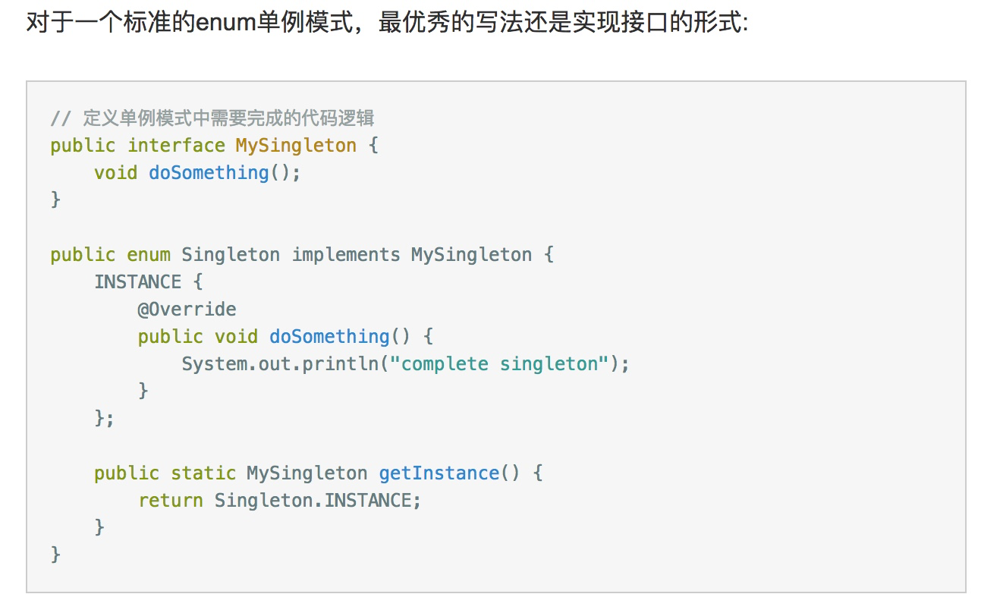

# GOF: Design Pattern学习总结

## 创建型模式

### 工厂模式，抽象工厂模式

Summary: 

	工厂模式：隐藏创建的具体实现（将创建的代码抽出来放到一个公用的类中）。工厂模式就是隐藏具体类的具体创建方式。工厂模式是工厂方法的参数化形式。即不通过继承（类的不同）来实现创建对象的不同，而是通过参数的不同来实现创建对象的不同。
	抽象工厂模式：
版本1.0: 
	就是隐藏工厂的具体创建方式。当同一类对象创建方式复杂，需要复用，而且创建的方式会变动，就选择工厂模式。
版本2.0:		
```
 定义了一组对象创建的接口，一个产品族的创建对应一个抽象工厂的子类实现。	
这里抽象工厂的实现一般都是单例模式。
接口对拓展支持新种类不友好，解决方案是使用参数传入，即make方法加一个标示参数就可以代表各种创建的含义。但是这样返回的接口太泛化了，可能会导致客户进行向下转型。 所以在灵活度和规则之间需要一个权衡。
创建的具体操作可以用工厂模式或者原型模式。
```
---

### 单例模式

Summary:

当一个全局使用的类被频繁的使用和销毁，控制实例数目，节约资源。
实现方式：

1. 懒汉式—>lazyLoad，线程不安全。

2. 懒汉式—>lazyLoad，线程安全。但是由于在getInstance方法上加上synchronize，导致很多不需要同步的地方同步了，严重影响效率

3. 饿汉式—>not LazyLoad，线程安全。利用classLoader机制实现了线程安全，但是可能在非getInstance调用的时候进行了类加载，然后创建了实例，所以不属于LazyLoad。

4. 懒汉式—>lazyLoad，线程安全。双检锁/双重校验锁。关键：synchronized (Singleton.class) 

5. 登记式/静态内部类。饿汉式，但是由于是内部类饿汉，所以加载时机还是由外部的调用决定加载时机的（静态内部类的特性），所以还是LazyLod。线程安全原理同3

6. 枚举

   由于枚举类型有一下特性：**线程安全，延迟加载，序列化与反序列化安全，反射安全**因此是单例模式的优秀写法。枚举类型的详细介绍点[这里](./java-enum.md)

   示例见下图：




---

### 建造者模式

Summary:

和工厂方法类似，但是建造者的类内部实现创建其他类的时候，参数会多一些，逻辑会复杂一些。

主要应用于：要创建的对象，组合依赖的东西比较多，建造者可以通过传入依赖的东西和组合的相关参数，来在建造者接口层面上实现对这些依赖的决定。

其本质上是一个工厂方法，但是要创建的类的依赖比较多且依赖之间可能存在关联，所以这个工厂方法不能直接是一个构造函数（会导致很多不必要的传参，而且增加参数的时候，所有用到构造函数的地方都得改动/构造函数本身要改动），而是分步骤地进行创建，往需要创建的类中传入依赖，最终建造成功返回。这里Builder会用到一些接口来控制传参数的顺序和必要性。(一般Builder是需要实例化的类的静态内部类)

Reference： 
博客：
https://blog.crisp.se/2013/10/09/perlundholm/another-builder-pattern-for-java
代码：
https://github.com/crispab/javabuilderpattern/blob/master/src/main/java/se/crisp/edu/java/builder/example/EmailMessageV3.java


---

### 原型模式

基本知识，java的clone和serialize机制：
重点：Java clone的浅拷贝，深拷贝。

	Java默认的clone是实现的浅拷贝，只把当前对象复制一份，但是对象内的依赖只是复制其引用，指向的还是原来的依赖对象。所以这里需要重写clone方法，设置依赖的对象为依赖对象clone出来的对象。但是依赖对象的依赖对象还是会是浅拷贝，所以这边需要清楚哪些是正真复制过来的，哪些只是复制一个引用。
	因此真正的深拷贝是serialize序列化，将整个对象的一条链恢复到内存。这里需要注意继承的时候父类非序列化以及serialVersionUID，静态变量序列化+transient关键字的问题。
Summary:
使用场景：  1、资源优化场景。 2、类初始化需要消化非常多的资源，这个资源包括数据、硬件资源等。 3、性能和安全要求的场景。 4、通过 new 产生一个对象需要非常繁琐的数据准备或访问权限，则可以使用原型模式。 5、一个对象多个修改者的场景。 6、一个对象需要提供给其他对象访问，而且各个调用者可能都需要修改其值时，可以考虑使用原型模式拷贝多个对象供调用者使用。 7、在实际项目中，原型模式很少单独出现，一般是和工厂方法模式一起出现，通过 clone 的方法创建一个对象，然后由工厂方法提供给调用者。原型模式已经与 Java 融为浑然一体，大家可以随手拿来使用。

Reference：
Clone: http://blog.csdn.net/zhangjg_blog/article/details/18369201

Serializable: http://blog.csdn.net/xiaomingdetianxia/article/details/74453033


---

### 小结：抽象工厂/工厂方法/Builder——以开眼为例

**抽象工厂：** 

	客户端每一个tab都分为上中下三部分，这里可以用抽象工厂分别生成这三部分的卡片列表。每个部分的列表可以用Builder创建。
	具体每种卡片的生成，也可以用抽象工厂，负责生成不同的卡片对象。

**工厂方法：**
	可以在tabController里，定义factory method，生成不同类型的tab内容（卡片列表）

**Builder：**
	复杂对象的创建，卡片列表可以用Builder生成(传入数据list,得到对应卡片的list)。然后具体每个卡片可以用抽象工厂生成。

**原型模式：**
	直接从原型clone对象。一般应用于类的实例状态少，克隆会比手动实例化更方便一点。例子：拖拽音符从工具栏到画板。音符对象直接是克隆自身就OK。个人感觉：重复性高的对象适合用这个生成。
---

## 结构型模式

### 适配器模式

Summary:

	当Target的接口需要利用Adaptee提供的接口，即被适配的对象的接口和提供给client的目标接口不一致。这里需要一个适配器对象，实现Target的接口，但是依赖于Adaptee对象。
-  一般实现有两种方法：对象适配器和类适配器。一般是对象适配器，组合Adaptee对象而不是类适配器的继承，因为继承的话耦合度太高。

-  如果Target的接口和Adaptee的接口是对等的关系，可能会互相调用，则可以建立一个双向的适配器。Adapter实现两个接口，然后组合两个对象，可以分别在Target接口和Adaptee接口中用对方的实现的对象。

-  一般不推荐过多使用，在解决正在服役的项目的问题的时候使用。设计的时候应当避免，接口有预见的抽象好是最好的。

  ​

---

### 关系：装饰器模式，策略模式，桥接模式

装饰器和策略：

- 装饰器是拓展（新增decorator的依赖之前的component）
- 策略模式是修改内核（context依赖于策略strategy）

桥接和策略：

- 桥接模式和策略结构上很像，但是是实现和抽象的分离，把具体实现交给Implementor。
- 而不是多个行为中选择一个行为这种对类的配置。


---

