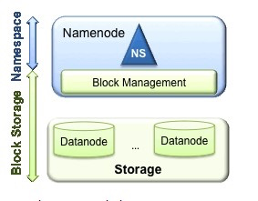
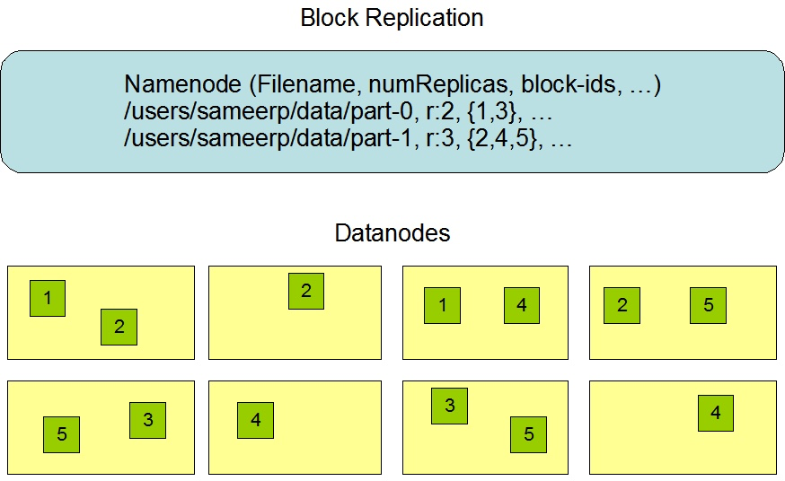

# Hadoop Learning RoadMap

## Plan-1.0

关于Hadoop的学习，本人计划分为***三个阶段***：

- Step 1: 基本使用和基本原理

  学习目标: 

  - Hdfs: 
    - 熟悉API的使用
    - 了解基本架构和各个模块的功能
  - MapReduce
    - 熟悉API的使用
    - 了解partition，shuffle，sort等工作原理，可以自己在纸上完整个画完mapreduce的流程( the more detailed, the better)
  - Yarn
    - //todo

- Step 2: 源代码分析（将基本概念映射到代码）

  学习目标：对hadoop源代码整体架构和局部的很多细节，有了一定的了解。比如你知道MapReduce Scheduler是怎样实现的，MapReduce shuffle过程中，map端做了哪些事情，reduce端做了哪些事情，是如何实现的，等等。这个阶段完成后，当你遇到问题或者困惑点时，可以迅速地在Hadoop源代码中定位相关的类和具体的函数，通过阅读源代码解决问题，这时候，hadoop源代码变成了你解决问题的参考书。

  学习建议：

  - 首先，你要摸清hadoop的代码模块，知道client，master，slave各自对应的模块（hadoop中核心系统都是master/slave架构，非常类似），并在阅读源代码过程中，时刻谨记你当前阅读的代码属于哪一个模块，会在哪个组件中执行；
  - 之后你需要摸清各个组件的交互协议，也就是分布式中的RPC，这是hadoop自己实现的，你需要对hadoop RPC的使用方式有所了解，然后看各模块间的RPC protocol，到此，你把握了系统的骨架，这是接下来**阅读源代码的基础**；
  - 接着，你要选择一个模块开始阅读，我一般会选择Client，这个模块相对简单些，会给自己增加信心，为了在阅读代码过程中，不至于迷失自己，建议在纸上画出类的调用关系，边看边画，我记得我阅读hadoop源代码时，花了一叠纸。注意，看源代码过程中，很容易烦躁不安，建议经常起来走走，不要把自己逼得太紧。
  - 在这个阶段，建议大家多看一些源代码分析博客和书籍，比如《Hadoop技术内幕》系列丛书（相关网站：[Hadoop技术内幕](https://link.zhihu.com/?target=http%3A//hadoop123.com/)）就是最好的参考资料。借助这些博客和书籍，你可以在前人的帮助下，更快地学习hadoop源代码，节省大量时间，注意，目前博客和书籍很多，建议大家广泛收集资料，找出最适合自己的参考资料。

- Step 3: 根据需求修改源代码（可作为毕业论文的方向）

---

## Plan-2.0

学习过程，和刚到公司，接手项目一样。关键是分层级的走下去。由宏观到微观。

第一步:

​	熟悉业务逻辑（这里的业务逻辑显得高端可能是因为搭建的是一个通用的系统，通用系统的流程显得高大上(当然，这样的系统的流程肯定是被仔细设计过的，很值得借鉴)）
​	这里的业务逻辑，可以分层级来看。第一个是总体逻辑，宏观上的把控，比如开眼首页用到了哪些功能，比如推荐，比如卡片封装，比如日报。然后就是再细化，推荐的具体逻辑是什么，有哪些推荐，怎么推荐的。比如Namenode怎么管理元数据的，怎么进行客户端请求的管理的。

第二步:

​	如何组织这些业务逻辑的。此时，就叫做系统的架构分析和思考了。这里面就会用到一些设计原则和设计模式。比如：

> 之前NameNode的包含了不光是Namespace的职责，还包括了BlockManagement的职责，见下图，使这两层存在耦合。难以让其他可能namenode实现方案直接使用block storage。这里的架构就存在问题，所以在hadoop2中引入federation进行了重构。



>  采用master/slave的结构。还有哪些平行的结构，这个的优势是什么。

第三步:

​	当你熟悉了某个模块的业务逻辑和架构之后，开始看源码。参考董大神的方法，从RPC开始了解怎么通信，然后client入手，看这个模块的代码。这里面的设计模式就更多了。都是代码层级的了。

> 比如：开眼的推荐，了解了有哪些推荐的功能，像tag推荐，视频推荐，来源于什么，输出了什么，什么时候刷新等等。然后再了解了，webapp负责实时计算和mongodb的缓存返回，offline负责tag的离线分数计算和数据记录，api负责访问webapp，以及cache。然后开始看源码，就很清楚了，从api的controller入手，慢慢看下去就OK。

---

## 基本使用和基本原理

### Hdfs

Hdfs之NameNode & DataNode
分布式高容错的文件系统

#### 职责
文件被切割成多个block，且被复制多份。
NameNode负责：
- 管理文件系统的命名空间（filename, numReplicas, block-ids,```）
- 同时也确定block-DataNode的映射
  - a Heartbeat来确定DataNode是否存活， a Blockreport来确定block到DataNode的映射
- 控制客户端的请求

DataNode负责：
- 提供来自文件系统客户端的读取和写入请求
- 根据来自NameNode的指令执行数据块创建，删除和复制

NameNode如何控制DataNode:(通信)
- HeartBeat:是否存活
- Blockreport：确定block到dataNode的映射


#### 数据复制逻辑详解：



> Replica Placement: The First Baby Steps(副本的位置选择)

> Replica Selection（读取副本的策略）

> Safemode（启动副本初始化策略）在启动时，NameNode进入一个称为Safemode的特殊状态。 当NameNode处于安全模式状态时，不会发生数据块的复制。 NameNode接收来自DataNode的Heartbeat和Blockreport消息。 Blockreport包含DataNode托管的数据块列表。 每个块都有指定的最小数量的副本。 当该数据块的最小副本数已与NameNode签入时，该块被认为是安全复制的。 在安全复制数据块的可配置百分比检入NameNode（再加上30秒）之后，NameNode退出安全模式状态。 然后确定数据块的列表（如果有的话）仍然少于指定的副本数量。 NameNode然后将这些块复制到其他DataNode。


#### 元数据持久化详解
> Fsimage:整个文件系统namespace（包括块到文件以及文件系统属性的映射）存储在名为FsImage的文件中。 FsImage作为文件存储在NameNode的本地文件系统中。

> EditLog:NameNode使用名为EditLog的事务日志来持久记录文件系统元数据发生的所有更改。EditLog作为文件存储在NameNode的本地文件系统中。

> CheckPoint:NameNode将整个文件系统namespace和文件的Blockmap的图像保存在内存中。当NameNode启动或检查点由可配置的阈值触发时，它从磁盘读取FsImage和EditLog，将EditLog中的所有事务应用到FsImage的内存中表示，并将此新版本刷新为磁盘上的新FsImage。
	- 非增量修改FsImage的原因：即使读取FsImage是高效的，直接对FsImage进行增量编辑效率也不高。

> block: DataNode将HDFS数据存储在本地文件系统中的文件中。DataNode并不知道HDFS文件的信息。它只是将每个HDFS block存储在本地文件系统中的单独文件中。 DataNode不会在同一目录中创建所有文件。相反，它使用启发式来确定每个目录的最佳文件数量并适当地创建子目录。在同一目录中创建所有本地文件并不是最佳选择，因为本地文件系统可能无法有效地支持单个目录中的大量文件。当DataNode启动时，它会扫描本地文件系统，生成与这些本地文件相对应的所有HDFS数据块的列表，并将此报告发送给NameNode。该报告称为Blockreport。


#### 通信协议
> 底层通信都是TCP/IP协议。

> Client to Namenode: ClientProtocol

> DataNode to Namenode: DataNode Protocol

> 最上层都是被RPC封装。A Remote Procedure Call (RPC) abstraction wraps both the Client Protocol and the DataNode Protocol.

> 这里注意到：Namenode不会主动调用RPC，它只负责回复DataNode和Client的RPC请求

#### 鲁棒性的保证
有三个常见的错误类型：NameNode failures, DataNode failures and network partitions.

##### network partitions：DataNode dead
1. 当Namenode检测到DataNode没有心跳了（默认10min，防止DataNodes的状态抖动，引起复制风暴replication storm。可以根据业务需求调节），才会标记DataNodes死亡
2. 标记死亡之后，NameNode不会把任何IO的请求转发给那些DataNode。因而注册到dead DataNode的数据不再能被HDFS获得
3. DataNode死亡可能导致某些块的复制因子降到其指定值以下。 NameNode会不断跟踪哪些块需要复制，并在需要时启动复制

Tip: 重新复制的必要性可能由于许多原因而产生：DataNode可能变得不可用，副本可能会损坏，DataNode上的硬盘可能会出故障，或者文件的复制因子可能会增加

##### DataNode: Data Rebalancing
Hdfs的架构和数据重新平衡方案是相容的。如：
> 如果DataNode的可用空间低于一个阈值，则存在方案，可以把数据从一个DataNode移动到另一个DataNode
> 如果对一个特定文件的需求忽然很高，存在方案可能会动态的创建额外的副本，并且重新平衡集群中其他数据。
> **这些数据重新平衡的方案目前尚未实现**

##### DataNode: Data Integrity
由于存储设备故障，网络故障或软件错误，从DataNode获取的数据块可能会损坏。
因此Hdfs客户端软件会对HDFS文件内容进行校验和的检查。
具体流程如下：
> 当客户端创建HDFS文件时，它会计算文件每个块的校验和，并将这些校验和存储在同一个HDFS名称空间中的单独隐藏文件中。 当客户端检索文件内容时，它会验证从每个DataNode收到的数据是否与存储在相关校验和文件中的校验和相匹配。 如果不是，那么客户端可以选择从另一个具有该块的副本的DataNode中检索该块。

##### NameNode: Metadata Disk Failure
FsImage和EditLog是HDFS的中心数据结构。这些文件的损坏可能会导致HDFS失效。由于这个原因，NameNode可以配置为支持维护多个副本的FsImage和EditLog。对FsImage或EditLog的任何更新都会导致每个FsImages和EditLog同步更新。同步更新FsImage和EditLog的多个副本可能会降低NameNode每秒可支持的名称空间事务处理速度。但是，这种降级是可以接受的，因为**即使HDFS应用程序本质上是非常密集的数据，它们也不是元数据密集型的**。当NameNode重新启动时，它会选择最新的一致的FsImage和EditLog来使用。

另一个增加弹性以抵御故障的方法是使用多个NameNode启用HA，使用NFS上的共享存储或使用分布式编辑日志（称为Journal）。后者是推荐的方法。

##### Snapshots
快照支持在特定时刻存储数据副本。 快照功能的一种用法可能是将损坏的HDFS实例回滚到先前已知的好的时间点。

#### 数据组织方法
- 数据分块：HDFS支持写入其数据一次，但读取一次或多次，并要求在**流速**下满足这些读取。因此一个HDFS文件被分成128 MB（可配置）的块，如果条件允许的话，每个块将驻留在不同的DataNode上。
- 复制流水线(Replication Pipelining)：对写入的每一块数据，NameNode使用复制目标选择算法，选择DataNode列表返回客户端。DataNode可以从流水线中的前一个接收数据，并且同时将数据转发到流水线中的下一个数据。（//todo 这边确定是每一块分配一个datanode列表么?）

#### 空间回收
- 删除文件：可以通过设置trash feature（默认是关闭），删除文件会先放入一个trash 文件夹。最近删除的文件被移动到当前的垃圾目录（/user/<username>/.Trash/Current），并且在可配置的时间间隔(fs.trash.checkpoint.interval)内，HDFS创建检查点（under /user/<username>/.Trash/<date>）查找当前垃圾目录中的文件，并在旧的检查点过期时(fs.trash.interval)删除它们。 详见关于垃圾检查点的[FS shell的删除命令](http://hadoop.apache.org/docs/r2.8.4/hadoop-project-dist/hadoop-common/FileSystemShell.html#expunge)。
  在trash生命周期结束后(fs.trash.interval)，NameNode将从HDFS命名空间中删除该文件。 删除文件会导致与文件关联的块被释放。 请注意，用户删除文件的时间与HDFS中相应增加可用空间的时间之间可能存在明显的时间延迟。

- 减少复制因子：当文件的复制因子减少时，NameNode选择可以删除的多余副本。 下一个Heartbeat将此信息传输到DataNode。 DataNode然后删除相应的块，并在群集中出现相应的可用空间。 和删除一样，setReplication API调用完成和群集中可用空间的出现之间可能存在时间延迟。

#### Accessbility
应用程序可以有很多方式访问HDFS。
**本质上**HDFS是提供了FileSystem Java API给应用程序使用。
还提供对这个API的C语言封装以及Rest API。
另外还有一个HTTP浏览器，也可以用来浏览HDFS实例的文件。 
通过使用NFS网关，HDFS可以作为客户端本地文件系统的一部分进行安装。
- FS Shell
- DFSAdmin
- Browser Interface

### Map Reduce

### Yarn

Reference: [Hadoop2原理介绍](https://blog.csdn.net/rxt2012kc/article/details/72644873)

---

## 源代码分析


---

## 改进源代码（可作为发论文的方向）


---

# QA:

1. 为什么我要阅读Hadoop源码？

   阅读hadoop源代码的目的不一定非是工作的需要，你可以把他看成一种修养，通过阅读hadoop源代码，加深自己对分布式系统的理解，培养自己踏实做事的心态。——摘自董西成（Hadoop内幕系列丛书作者）的知乎回答