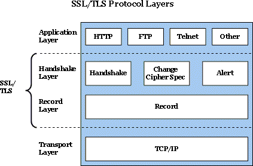

# Https

### 起因：（http的缺陷）
不加密的http通信，会存在以下三个问题：
> 1. 窃听风险 eavesdropping
> 2. 篡改风险 tampering
> 3. 冒充风险 message forgery

### Https原理：
Https相当于在Http协议的基础上，包装了一层（Decorator模式）。利用SSL/TSL协议进行加密。下面是协议的层级图：



#### SSL/TSL由来:

互联网加密通信协议的历史，几乎与互联网一样长。

> 1994年，NetScape公司设计了SSL协议（Secure Sockets Layer）的1.0版，但是未发布。

> 1995年，NetScape公司发布SSL 2.0版，很快发现有严重漏洞。

> 1996年，SSL 3.0版问世，得到大规模应用。

> 1999年，互联网标准化组织ISOC接替NetScape公司，发布了SSL的升级版TLS 1.0版(Transport Layer Security)。

> 2006年和2008年，TLS进行了两次升级，分别为TLS 1.1版和TLS 1.2版。最新的变动是2011年TLS 1.2的修订版。
> 目前，应用最广泛的是TLS 1.0，接下来是SSL 3.0。但是，主流浏览器都已经实现了TLS 1.2的支持。

TLS 1.0通常被标示为SSL 3.1，TLS 1.1为SSL 3.2，TLS 1.2为SSL 3.3。

#### SSL/TSL加密的原理：

基本思路：

- 客户端向服务器索要公钥
- 客户端信息用公钥加密
- 服务器用私钥解密信息。

缺陷：

> 公钥被篡改（将公钥放在数字证书中，数字证书证明这个公钥是你要访问的网站对应的公钥。如果证书机构不可信任，则会给别人颁布一个你这个域名的证书，别人就可以篡改公钥和客户端通信了）

> 非对称加密解密计算量大（先用非对称加密协商出一个对话的密钥，之后用这个密钥进行对称加密，由于每次回话这个密钥都不一样，具有时效性）（）

改进后的基本思路：

- 客户端向服务器索要公钥，根据数字证书的办法机构是否可信&&数字证书域名和实际的域名一致&&证书没有过期，来继续通信

- 双方协商生成"对话密钥"。

- 双方采用"对话密钥"进行加密通信。

  下面是详细流程图：


下面进行每个阶段的详细介绍：//todo 


### 非对称加密原理(RSA)//todo


### 申请证书到配置Nginx
把签发的证书文件(.crt/.pem)和对应的密钥.key文件配置到需要的server下即可
```nginx
    listen       443 ssl;
    server_name  blog-zhangyi.dolores.me;
    ssl                  on;
    ssl_certificate     /home/zhangyi/https_conf/1_blog-zhangyi.dolores.me_bundle.crt;#配置证书位置
    ssl_certificate_key  /home/zhangyi/https_conf/2_blog-zhangyi.dolores.me.key;#配置秘钥位置
    #ssl_client_certificate ca.crt;#双向认证
    #ssl_verify_client on; #双向认证

    ssl_session_timeout  5m;
    ssl_protocols  SSLv2 SSLv3 TLSv1;
    ssl_ciphers  ALL:!ADH:!EXPORT56:RC4+RSA:+HIGH:+MEDIUM:+LOW:+SSLv2:+EXP;
    ssl_prefer_server_ciphers   on;
```

Reference:
[TSL1.2 RFC文档](https://tools.ietf.org/html/rfc5246)
[Google Sites SSL/TLS](https://sites.google.com/site/tlsssloverview/ssl-tls-protocol-layers)
[阮一峰](http://www.ruanyifeng.com/blog/2014/02/ssl_tls.html?20180510201551#comment-last)