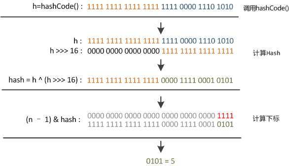

# HashMap原理

### 前言：

HashMap在Java开发中非常常见，作为Java程序员，了解这个类可以说是一种修养了（毕竟每天见到，不知道内部原理说不过去呀～）

> 这里的HashMap的分析是基于Java 1.8的


### 简介：

在我们计算机学科，要学习一个东西，最好，最有效的方法就是看他的官方文档。在这里就是Javadoc，所以我们第一步，来看一下官方是怎么描述这个类的：('-'之后为本人翻译的中文总结)

```Java
/**
 * Hash table based implementation of the <tt>Map</tt> interface.  This
 * implementation provides all of the optional map operations, and permits
 * <tt>null</tt> values and the <tt>null</tt> key.  (The <tt>HashMap</tt>
 * class is roughly equivalent to <tt>Hashtable</tt>, except that it is
 * unsynchronized and permits nulls.)  This class makes no guarantees as to
 * the order of the map; in particular, it does not guarantee that the order
 * will remain constant over time.
 - 实现了Map接口，提供所有map操作
 - 允许null key和null value
 - 不同步（和Hashtable基本相同，除了【不同步】和【允许null值】）
 - 不保证顺序（可能一段时间之后，读取的顺序就发生了变化）（rehashing带来的问题）
 
 *
 * <p>This implementation provides constant-time performance for the basic
 * operations (<tt>get</tt> and <tt>put</tt>), assuming the hash function
 * disperses the elements properly among the buckets.  Iteration over
 * collection views requires time proportional to the "capacity" of the
 * <tt>HashMap</tt> instance (the number of buckets) plus its size (the number
 * of key-value mappings).  Thus, it's very important not to set the initial
 * capacity too high (or the load factor too low) if iteration performance is
 * important.
 - 提供常数时间的基本操作（get/put）
 - 集合迭代的时间和 capacity+size 成正相关（因此，需要好的迭代表现，需要capacity不要太高/load factor太低）(这几个参数，上面的英文和后文里有解释，这里就不写出了)
 
 *
 * <p>An instance of <tt>HashMap</tt> has two parameters that affect its
 * performance: <i>initial capacity</i> and <i>load factor</i>.  The
 * <i>capacity</i> is the number of buckets in the hash table, and the initial
 * capacity is simply the capacity at the time the hash table is created.  The
 * <i>load factor</i> is a measure of how full the hash table is allowed to
 * get before its capacity is automatically increased.  When the number of
 * entries in the hash table exceeds the product of the load factor and the
 * current capacity, the hash table is <i>rehashed</i> (that is, internal data
 * structures are rebuilt) so that the hash table has approximately twice the
 * number of buckets.
 - 两个影响HashMap表现的因素：initial capacity 和 load factor
 - 简单的说，Capacity就是buckets的数目，Load factor就是buckets填满程度的最大比例。如果对迭代性能要求很高的话不要把capacity设置过大，也不要把load factor设置过小。当bucket填充的数目（即hashmap中元素的个数）大于capacity*load factor时就调整buckets的数目为当前的2倍。
 
 *
 * <p>As a general rule, the default load factor (.75) offers a good
 * tradeoff between time and space costs.  Higher values decrease the
 * space overhead but increase the lookup cost (reflected in most of
 * the operations of the <tt>HashMap</tt> class, including
 * <tt>get</tt> and <tt>put</tt>).  The expected number of entries in
 * the map and its load factor should be taken into account when
 * setting its initial capacity, so as to minimize the number of
 * rehash operations.  If the initial capacity is greater than the
 * maximum number of entries divided by the load factor, no rehash
 * operations will ever occur.
 - entries数目的预估来设置initial capacity可以有效的减少rehashing的次数
 
 *
 * <p>If many mappings are to be stored in a <tt>HashMap</tt>
 * instance, creating it with a sufficiently large capacity will allow
 * the mappings to be stored more efficiently than letting it perform
 * automatic rehashing as needed to grow the table.  Note that using
 * many keys with the same {@code hashCode()} is a sure way to slow
 * down performance of any hash table. To ameliorate impact, when keys
 * are {@link Comparable}, this class may use comparison order among
 * keys to help break ties.
 - 当有很多key有相同的hashcode，肯定会对效率产生影响
 - 为了改善影响，这个类may(这里咋翻译，是可能么，还没有验证)用比较顺序来帮助打破这里的问题
 
 *
 * <p><strong>Note that this implementation is not synchronized.</strong>
 * If multiple threads access a hash map concurrently, and at least one of
 * the threads modifies the map structurally, it <i>must</i> be
 * synchronized externally.  (A structural modification is any operation
 * that adds or deletes one or more mappings; merely changing the value
 * associated with a key that an instance already contains is not a
 * structural modification.)  This is typically accomplished by
 * synchronizing on some object that naturally encapsulates the map.
 - structural modification: 添加/删除一个或多个键值对（影响内部的结构了）
 - 当发生多个线程使用hashmap，且至少有一个线程结构性的改变了这个map，则需要通过封装这个map（装饰器模式）来实现同步
 
 *
 * If no such object exists, the map should be "wrapped" using the
 * {@link Collections#synchronizedMap Collections.synchronizedMap}
 * method.  This is best done at creation time, to prevent accidental
 * unsynchronized access to the map:<pre>
 *   Map m = Collections.synchronizedMap(new HashMap(...));</pre>
 - 一般通过 Map m = Collections.synchronizedMap(new HashMap(...))在初始化的时候封装这个类
 
 *
 * <p>The iterators returned by all of this class's "collection view methods"
 * are <i>fail-fast</i>: if the map is structurally modified at any time after
 * the iterator is created, in any way except through the iterator's own
 * <tt>remove</tt> method, the iterator will throw a
 * {@link ConcurrentModificationException}.  Thus, in the face of concurrent
 * modification, the iterator fails quickly and cleanly, rather than risking
 * arbitrary, non-deterministic behavior at an undetermined time in the
 * future.
 - 有一个fail-fast机制，当在迭代时，map被结构性的改变了，则会【调用迭代器的remove方法】以及【抛出ConcurrentModificationException异常】
 
 *
 * <p>Note that the fail-fast behavior of an iterator cannot be guaranteed
 * as it is, generally speaking, impossible to make any hard guarantees in the
 * presence of unsynchronized concurrent modification.  Fail-fast iterators
 * throw <tt>ConcurrentModificationException</tt> on a best-effort basis.
 * Therefore, it would be wrong to write a program that depended on this
 * exception for its correctness: <i>the fail-fast behavior of iterators
 * should be used only to detect bugs.</i>
 - fail-fast机制是用于检测错误的，并不能保证正确性。因为毕竟非同步的并发操作是不可能作出任何硬性保证的
 
 *
 * <p>This class is a member of the
 * <a href="{@docRoot}/../technotes/guides/collections/index.html">
 * Java Collections Framework</a>.
 *
 * @param <K> the type of keys maintained by this map
 * @param <V> the type of mapped values
 *
 * @author  Doug Lea
 * @author  Josh Bloch
 * @author  Arthur van Hoff
 * @author  Neal Gafter
 * @see     Object#hashCode()
 * @see     Collection
 * @see     Map
 * @see     TreeMap
 * @see     Hashtable
 * @since   1.2
 */
```

下面针对上述文档进行总结：

##### 首先介绍了特性：

 - 实现了Map接口，提供所有map操作
 - 允许null key和null value
 - 不同步（和Hashtable基本相同，除了【不同步】和【允许null值】）
 - 不保证顺序（可能一段时间之后，读取的顺序就发生了变化）（rehashing带来的问题）

##### 接着介绍了影响HashMap表现的因素：

- Capacity：buckets的数目
- Load factor：buckets填满程度的最大比例。
- 如果对**迭代性能**要求很高的话不要把capacity设置过大，也不要把load factor设置过小。当bucket填充的数目（即hashmap中元素的个数）大于capacity*load factor时就调整buckets的数目为当前的2倍。
- entries数目的预估来设置initial capacity可以有效的**减少rehashing的次数**
- 当有很多key有相同的hashcode，肯定会对效率产生影响。为了**改善key hashcode重复的影响**，这个类may(*这里咋翻译，是可能么，还没有验证有没有实现*)用比较顺序来帮助打破这里的问题

##### 最后介绍了并发的同步处理和非同步处理：

 - structural modification: 添加/删除一个或多个键值对（影响内部的结构了）

 - 同步处理：当发生多个线程使用hashmap，且至少有一个线程结构性的改变了这个map，则需要通过封装这个map（装饰器模式）来实现同步。一般通过 

   ```Java
   Map m = Collections.synchronizedMap(new HashMap(…))
   ```

   在初始化的时候封装这个类。

- 非同步处理（不进行同步处理）：

  - 有一个fail-fast机制，当在迭代时，map被结构性的改变了，则会【调用迭代器的remove方法】以及【抛出ConcurrentModificationException异常】
  - fail-fast机制是用于检测错误的，并不能保证正确性。因为毕竟非同步的并发操作是不可能作出任何硬性保证的


### Put函数实现：

HashMap，最重要的两个操作就是，写入和读取。下面我们来看一下put函数的具体实现，内部做了什么。

##### 大致思路：

1. 对key的hashCode()做hash，然后再计算index;
   - 如果没碰撞直接放到bucket里；
   - 如果碰撞了，以链表的形式存在buckets后；
   - 如果碰撞导致链表过长(大于等于TREEIFY_THRESHOLD)，就把链表转换成红黑树；
   - 如果节点已经存在就替换old value(保证key的唯一性)
2. 如果bucket满了(键值对的数量超过load factor*current capacity, 即碰撞概率太大了)，就要resize/rehashed。


##### 代码解析：

```Java
/**
 * Associates the specified value with the specified key in this map.
 * If the map previously contained a mapping for the key, the old
 * value is replaced.
 *
 * @param key key with which the specified value is to be associated
 * @param value value to be associated with the specified key
 * @return the previous value associated with <tt>key</tt>, or
 *         <tt>null</tt> if there was no mapping for <tt>key</tt>.
 *         (A <tt>null</tt> return can also indicate that the map
 *         previously associated <tt>null</tt> with <tt>key</tt>.)
 */
public V put(K key, V value) {
    //根据key的hashcode计算key的hash
    return putVal(hash(key), key, value, false, true);
}

/**
 * Implements Map.put and related methods
 *
 * @param hash hash for key
 * @param key the key
 * @param value the value to put
 * @param onlyIfAbsent if true, don't change existing value
 * @param evict if false, the table is in creation mode.
 * @return previous value, or null if none
 */
final V putVal(int hash, K key, V value, boolean onlyIfAbsent,
               boolean evict) {
    Node<K,V>[] tab; Node<K,V> p; int n, i;
    //如果哈希表为空，则创建
    if ((tab = table) == null || (n = tab.length) == 0)
        n = (tab = resize()).length;
    //计算key的hash对应的index的值，如果为空则直接插入
    if ((p = tab[i = (n - 1) & hash]) == null)
        tab[i] = newNode(hash, key, value, null);
    else {
        Node<K,V> e; K k;
        //如果第一个node就是该key，则当前要操作的node变为当前node
        if (p.hash == hash &&
            ((k = p.key) == key || (key != null && key.equals(k))))
            e = p;
        //否则，如果节点是树的形式，则加入树中
        else if (p instanceof TreeNode)
            e = ((TreeNode<K,V>)p).putTreeVal(this, tab, hash, key, value);
        //否则，节点是链表的形式，遍历链表，直到找到相同key的节点/插入链表尾部
      	else {
            for (int binCount = 0; ; ++binCount) {
                if ((e = p.next) == null) {
                    p.next = newNode(hash, key, value, null);
                    if (binCount >= TREEIFY_THRESHOLD - 1) // -1 for 1st
                        treeifyBin(tab, hash);
                    break;
                }
                if (e.hash == hash &&
                    ((k = e.key) == key || (key != null && key.equals(k))))
                    break;
                p = e;
            }
        }
      	//如果存在旧值，把新值写入
        if (e != null) { // existing mapping for key
            V oldValue = e.value;
            if (!onlyIfAbsent || oldValue == null)
                e.value = value;
            afterNodeAccess(e);
            return oldValue;
        }
    }
    ++modCount;
    if (++size > threshold)
        resize();
    afterNodeInsertion(evict);
    return null;
}
```


### Get函数实现：

HashMap，最重要的两个操作就是，写入和读取。下面我们来看一下get函数的具体实现，内部做了什么。

##### 大致思路：

1. 对key的hashCode()做hash，然后再计算index;
2. bucket里的第一个节点，直接命中；
3. 如果有冲突，则通过key.equals(k)去查找对应的entry
   - 若为树，则在树中通过key.equals(k)查找，O(logn)；
   - 若为链表，则在链表中通过key.equals(k)查找，O(n)。

##### 代码解析：

```java
/**
 * Returns the value to which the specified key is mapped,
 * or {@code null} if this map contains no mapping for the key.
 *
 * <p>More formally, if this map contains a mapping from a key
 * {@code k} to a value {@code v} such that {@code (key==null ? k==null :
 * key.equals(k))}, then this method returns {@code v}; otherwise
 * it returns {@code null}.  (There can be at most one such mapping.)
 *
 * <p>A return value of {@code null} does not <i>necessarily</i>
 * indicate that the map contains no mapping for the key; it's also
 * possible that the map explicitly maps the key to {@code null}.
 * The {@link #containsKey containsKey} operation may be used to
 * distinguish these two cases.
 *
 * @see #put(Object, Object)
 */
public V get(Object key) {
    Node<K,V> e;
    return (e = getNode(hash(key), key)) == null ? null : e.value;
}

/**
 * Implements Map.get and related methods
 *
 * @param hash hash for key
 * @param key the key
 * @return the node, or null if none
 */
final Node<K,V> getNode(int hash, Object key) {
    Node<K,V>[] tab; Node<K,V> first, e; int n; K k;
  	//判断表是否为空&链的第一个节点是否存在
    if ((tab = table) != null && (n = tab.length) > 0 &&
        (first = tab[(n - 1) & hash]) != null) {
      	//直接命中第一个节点
        if (first.hash == hash && // always check first node
            ((k = first.key) == key || (key != null && key.equals(k))))
            return first;
      	//未命中
        if ((e = first.next) != null) {
          	//在树中查找
            if (first instanceof TreeNode)
                return ((TreeNode<K,V>)first).getTreeNode(hash, key);
          	//在链表中查找
            do {
                if (e.hash == hash &&
                    ((k = e.key) == key || (key != null && key.equals(k))))
                    return e;
            } while ((e = e.next) != null);
        }
    }
    return null;
}
```


### Hash函数实现：

在get和put的过程中，计算下标时，先对hashCode进行hash操作，然后再通过hash值进一步计算下标。我们来看下hash函数是如何设计的。

##### 大致思路：




可以看出大致流程

- 首先得到hashCode
- 然后高16bit不变，低16bit和高16bit做了一个**异或**。
- 最后$n-1 \& hash$即为$hash\ mod\  (n-1)$即为**求余**（保留最后几位，由表的大小决定）(这里最后下标的范围由二进制表示，所以可以看出表的大小永远是2的n次幂)

##### 代码解析：

```java
/**
 * Computes key.hashCode() and spreads (XORs) higher bits of hash
 * to lower.  Because the table uses power-of-two masking, sets of
 * hashes that vary only in bits above the current mask will
 * always collide. (Among known examples are sets of Float keys
 * holding consecutive whole numbers in small tables.)  So we
 * apply a transform that spreads the impact of higher bits
 * downward. There is a tradeoff between speed, utility, and
 * quality of bit-spreading. Because many common sets of hashes
 * are already reasonably distributed (so don't benefit from
 * spreading), and because we use trees to handle large sets of
 * collisions in bins, we just XOR some shifted bits in the
 * cheapest possible way to reduce systematic lossage, as well as
 * to incorporate impact of the highest bits that would otherwise
 * never be used in index calculations because of table bounds.
 */
//这里的高位和低位的异或，是作者合考虑了速度、作用、质量的一个tradeoff，设计者还解释到因为现在大多数的
//hashCode的分布已经很不错了，就算是发生了碰撞也用O(logn)的tree去做了。仅仅异或一下，既减少了系统的开
//销，也不会造成的因为高位没有参与下标的计算(table长度比较小时)，从而引起的碰撞。
static final int hash(Object key) {
    int h;
    return (key == null) ? 0 : (h = key.hashCode()) ^ (h >>> 16);
}
```


### Resize函数实现：

当put时，如果发现目前的bucket占用程度已经超过了Load Factor所希望的比例，那么就会发生resize。在resize的过程，简单的说就是把bucket扩充为2倍，之后重新计算index，把节点再放到新的bucket中。

##### 大致思路：

当超过限制的时候会resize，然而又因为我们使用的是2次幂的扩展(指长度扩为原来2倍)，所以，<u>**元素的位置要么是在原位置，要么是在原位置再移动2次幂的位置。**</u>

例如我们从16扩展为32时，具体的变化如下所示：


因此元素hash值不变，因为n变为2倍，那么n-1的mask范围在高位多1bit(红色)，因此index就会发生这样的变化：


因此，我们在扩充HashMap的时候，不需要重新计算hash，只需要看看原来的hash值新增的那个bit是1还是0就好了，是0的话索引没变，是1的话索引变成“原索引+oldCap”。可以看看下图为16扩充为32的resize示意图：


这个设计确实非常的巧妙，既省去了重新计算hash值的时间，而且同时，由于新增的1bit是0还是1可以认为是随机的，因此resize的过程，均匀的把之前的冲突的节点分散到新的bucket了。

##### 代码解析：

```java
/**
 * Initializes or doubles table size.  If null, allocates in
 * accord with initial capacity target held in field threshold.
 * Otherwise, because we are using power-of-two expansion, the
 * elements from each bin must either stay at same index, or move
 * with a power of two offset in the new table.
 *
 * @return the table
 */
final Node<K,V>[] resize() {
    Node<K,V>[] oldTab = table;
    int oldCap = (oldTab == null) ? 0 : oldTab.length;
    int oldThr = threshold;
    int newCap, newThr = 0;
    if (oldCap > 0) {
        if (oldCap >= MAXIMUM_CAPACITY) {
            threshold = Integer.MAX_VALUE;
            return oldTab;
        }
        else if ((newCap = oldCap << 1) < MAXIMUM_CAPACITY &&
                 oldCap >= DEFAULT_INITIAL_CAPACITY)
            newThr = oldThr << 1; // double threshold
    }
    else if (oldThr > 0) // initial capacity was placed in threshold
        newCap = oldThr;
    else {               // zero initial threshold signifies using defaults
        newCap = DEFAULT_INITIAL_CAPACITY;
        newThr = (int)(DEFAULT_LOAD_FACTOR * DEFAULT_INITIAL_CAPACITY);
    }
    if (newThr == 0) {
        float ft = (float)newCap * loadFactor;
        newThr = (newCap < MAXIMUM_CAPACITY && ft < (float)MAXIMUM_CAPACITY ?
                  (int)ft : Integer.MAX_VALUE);
    }
    threshold = newThr;
    @SuppressWarnings({"rawtypes","unchecked"})
        Node<K,V>[] newTab = (Node<K,V>[])new Node[newCap];
    table = newTab;
    if (oldTab != null) {
        for (int j = 0; j < oldCap; ++j) {
            Node<K,V> e;
            if ((e = oldTab[j]) != null) {
                oldTab[j] = null;
                if (e.next == null)
                    newTab[e.hash & (newCap - 1)] = e;
                else if (e instanceof TreeNode)
                    ((TreeNode<K,V>)e).split(this, newTab, j, oldCap);
                else { // preserve order
                    Node<K,V> loHead = null, loTail = null;
                    Node<K,V> hiHead = null, hiTail = null;
                    Node<K,V> next;
                    do {
                        next = e.next;
                        if ((e.hash & oldCap) == 0) {
                            if (loTail == null)
                                loHead = e;
                            else
                                loTail.next = e;
                            loTail = e;
                        }
                        else {
                            if (hiTail == null)
                                hiHead = e;
                            else
                                hiTail.next = e;
                            hiTail = e;
                        }
                    } while ((e = next) != null);
                    if (loTail != null) {
                        loTail.next = null;
                        newTab[j] = loHead;
                    }
                    if (hiTail != null) {
                        hiTail.next = null;
                        newTab[j + oldCap] = hiHead;
                    }
                }
            }
        }
    }
    return newTab;
}
```

### Reference:

[Java HashMap工作原理及实现](https://yikun.github.io/2015/04/01/Java-HashMap%E5%B7%A5%E4%BD%9C%E5%8E%9F%E7%90%86%E5%8F%8A%E5%AE%9E%E7%8E%B0/)

[HashMap源码1.7分析](https://www.jianshu.com/p/4ee6cbb83cc8)