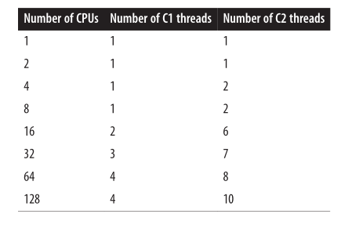

# JIT

JIT—Just In Time Compiler，翻译为即时编译器。作用是加速Java程序的执行速度。主要是通过JVM<u>解释执行</u>字节码的过程进行优化，会把翻译过来的机器码保存起来，避免了多次解释相同代码的过程。


### Hot Spot

Hot Spot VM 采用了 JIT compile 技术，将<u>运行频率很高的字节码</u>直接编译为机器指令执行以提高性能，所以当字节码被 JIT 编译为机器码的时候，要说JAVA是编译执行（没有JIT则是半编译半解释）的也可以。也就是说，运行时，部分代码可能由 JIT 翻译为目标机器指令（以 method 为翻译单位，还会保存起来，第二次执行就不用翻译了）直接执行。

- 寄存器的使用是编译器的一个非常普遍的优化。（注意线程同步）
- 一些方法调用的编译，使得无需查找该调用哪个方法。比如obj.equals()方法，可以在obj类型固定之后，直接调用编译后的该类型的equals方法


### Compiler 调优

下面分为初级->中级->高级三个阶段来介绍如何为JIT Compiler调优。这三个阶段可以理解成为越来越底层具体的优化方案。<u>主要是调用的时机和分配的资源的调整</u>。

#### 初级

Client 和 Server模式的选择。JIT 编译器在运行程序时有两种编译模式可以选择，并且其会在运行时决定使用哪一种以达到最优性能。这两种编译模式的命名源自于命令行参数（eg: -client 或者 -server）。JVM Server 模式与 client 模式启动，最主要的差别在于：-server 模式<u>启动时，速度较慢</u>，但是一旦运行起来后，性能将会有很大的提升。原因是：当虚拟机运行在-client 模式的时候，使用的是一个代号为 C1 的轻量级编译器，而-server 模式启动的虚拟机采用相对重量级代号为 C2 的编译器。C2 比 C1 编译器编译的相对彻底，<u>服务起来之后，性能更高</u>。

|                 | 启动命令                           | 启动速度 | 性能    |
| --------------- | ------------------------------ | ---- | ----- |
| Client（C1编译器）   | -client                        | 快    | 慢（保守） |
| Server（C2编译器）   | -server                        | 慢    | 高（激进） |
| 分层编译（C1 and C2） | -server -XX:+TieredCompilation | 中等   | 中等    |

---

#### 中级

- **编译阈值**：在 JVM 中，编译是基于两个计数器的：一个是方法被调用的次数，另一个是方法中循环被回弹执行的次数。

  当 JVM 执行一个 Java 方法，它会检查这两个计数器的总和以决定这个方法是否有资格被编译。如果有，则这个方法将排队等待编译。这种编译形式并没有一个官方的名字，但是一般被叫做<u>标准编译</u>。

   ```
   -XX:CompileThreshold=N 标准编译的触发阈值。Client 编译器模式下，N 默认的值 1500，而 Server 编译器模式下，N 默认的值则是 10000。
   ```

  但是如果方法里有一个很长的循环且该方法只能执行一次呢（比如main函数里执行循环）？这种情况下，JVM 需要编译循环而并不等待方法被调用。所以每执行完一次循环，分支计数器都会自增和自检。如果分支计数器计数超出其自身阈值，那么这个循环（并不是整个方法）将具有被编译资格。

  这种编译叫做<u>栈上替换（OSR）</u>，因为即使循环被编译了，这也是不够的：JVM 必须有能力当循环正在运行时，开始执行此循环已被编译的版本。换句话说，当循环的代码被编译完成，若 JVM 替换了代码（前栈），那么循环的下个迭代执行最新的被编译版本则会更加快。

  ```
  -XX:CompileThreshold = 10000 
  -XX:OnStackReplacePercentage = 140
  -XX:InterpreterProfilePercentage = 33
  OSR trigger = (CompileThreshold * (OnStackReplacePercentage -  InterpreterProfilePercentage)) / 100 = 10700
  ```


  <u>如果一个方法被标准编译方式所编译，那么下一个方法调用则会执行已编译的方法。如果一个循环被栈上替换方式所编译，那么下一次循环迭代则会执行新编译的代码。</u>

- **代码缓存**：当 JVM 编译代码时，它会将汇编指令集保存在代码缓存。代码缓存具有固定的大小，并且一旦它被填满，JVM 则不能再编译更多的代码。

  <u>问题</u>：有些热点代码将会被编译，而其他的则不会被编译，这个应用程序将会以运行大量的解释代码来结束。当使用client编译器模式编译合格的代码的数量将会高很多。

  <u>解决方案</u>：现在并没有一个好的机制可以确定一个特定的应用到底需要多大的代码缓存。一个通常的做法是将代码缓存变成默认大小的两倍或四倍。

  ```
  –XX:ReservedCodeCacheSize=N 最大化代码缓存大小，一般必要，可以优化性能。	
  -XX:InitialCodeCacheSize=N 代码缓存初始化大小，基于芯片架构以及使用的编译器(client/server)的。修改这个对性能影响不大，一般不会修改这个。
  ```

- **verbose模式**：打印出编译的过程

  ```
  --XX:+PrintCompilation 默认状态下是 false
  ```

- **jstat查看编译过程**

  ```
  % jstat -compiler 6006	//查看进程详情
  % jstat –printcompilation 6006 1000	//每1000ms查看一次最后一个被编译的方法的编译信息
  ```

  ​

---

#### 高级

**编译线程**：从前文中我们知道，当一个方法（或循环）拥有编译资格时，它就会排队并等待编译。<u>这个队列是由一个或很多个后台线程组成</u>。这些队列并不会严格的遵守先进先出原则：哪一个方法的调用计数器计数更高，哪一个就拥有优先权。所以即使当一个程序开始执行，并且有大量的代码需要编译，这个优先权顺序将帮助并保证最重要的代码被优先编译。

当使用 client 编译器时，JVM 启动一个编译线程，而 server 编译器有两个这样的线程。当分层编译生效时，JVM 会基于某些复杂方程式默认启动多个 client 和 server 线程，涉及双日志在目标平台上的 CPU 数量。如下图所示：



```
-XX:CICompilerCount=N 调节设置编译器线程的数量，这个数量是 JVM 将要执行队列所用的线程总数。对于分层编译，三分之一的（至少一个）线程被用于执行 client 编译器队列，剩下的（也是至少一个）被用来执行 server 编译器队列。
```

以上编译是异步的。我们也可以设置为同步编译。（即遇到需要编译的地方，等待编译完成再运行）

```
-XX:-BackgroundCompilation 可以关闭异步编译(注意前面是'减号')
```

---

### 逃逸分析(JNI编译时进行的优化)

**与JNI的关系：在编译的时候，会进行逃逸分析和相应优化。**

<u>所以通过调整编译的阈值->提早/推迟编译的时间->优化的效果会不同（同时调整编译的阈值也会带来更多/更少的代码需要编译的问题->调整代码缓存的大小）</u>

```
-XX:+DoEscapeAnalysis 开启逃逸分析（注意前面是'加号'）
```

<u>逃逸分析并不是直接的优化手段</u>，而是一个代码分析，通过动态分析对象的作用域，<u>为其它优化手段如栈上分配、标量替换和同步消除等提供依据</u>，发生逃逸行为的情况有两种：方法逃逸和线程逃逸。
1、方法逃逸：当一个对象在方法中定义之后，作为参数传递到其它方法中；
2、线程逃逸：如类变量或实例变量，可能被其它线程访问到；

如果不存在逃逸行为，则可以对该对象进行如下优化：<u>同步消除、标量替换和栈上分配</u>。

- 同步消除

  线程同步本身比较耗，如果确定一个对象不会逃逸出线程，无法被其它线程访问到，那该对象的读写就不会存在竞争，则可以消除对该对象的同步锁，通过-XX:+EliminateLocks可以开启同步消除。

- 标量替换

  1、标量是指不可分割的量，如java中基本数据类型和reference类型，相对的一个数据可以继续分解，称为聚合量；
  2、如果把一个对象拆散，将其成员变量恢复到基本类型来访问就叫做标量替换；
  3、如果逃逸分析发现一个对象不会被外部访问，并且该对象可以被拆散，那么经过优化之后，并不直接生成该对象，而是在栈上创建若干个成员变量；

  ```
  -XX:+EliminateAllocations	可以开启标量替换
  -XX:+PrintEliminateAllocations	查看标量替换情况。
  ```

- 栈上分配

  故名思议就是在栈上分配对象，其实目前Hotspot并没有实现真正意义上的栈上分配，实际上是标量替换。


Reference:

[IBM深入浅出 JIT 编译器](https://www.ibm.com/developerworks/cn/java/j-lo-just-in-time/index.html)

[浅谈HotSpot逃逸分析](https://toutiao.io/posts/s2f52g/preview)